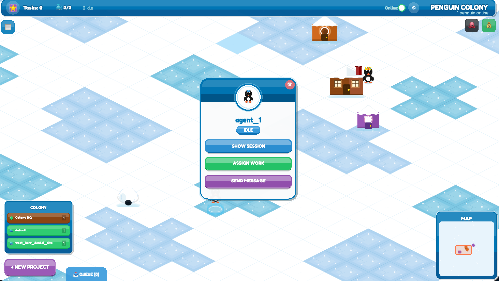
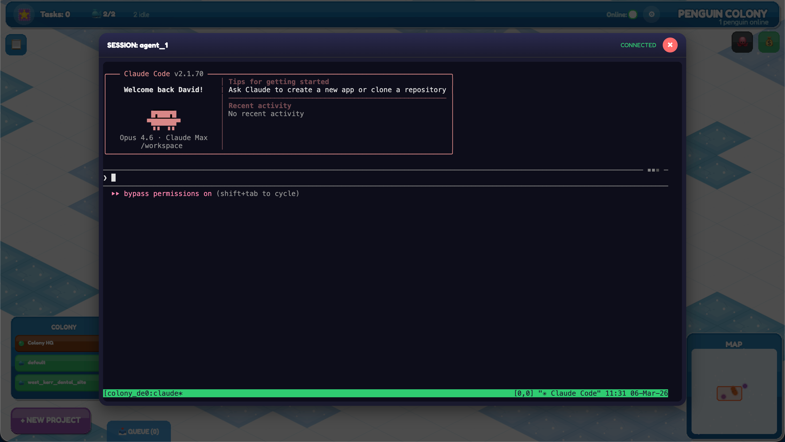
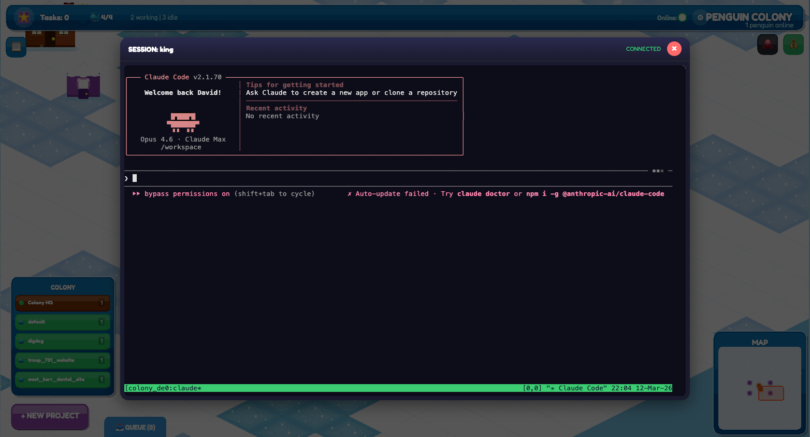

# Penguin Colony

A Club Penguin-inspired browser UI for managing [Claude Code](https://docs.anthropic.com/en/docs/claude-code) agent teams. Agents appear as penguins on an isometric snow map. Click them to assign work, view live terminal sessions, or send messages — all through a game-style interface backed by real Claude Code CLI sessions running in Docker sandboxes.







## Features

- **Isometric colony map** — penguins waddle around a snowy landscape with buildings
- **Agent management** — spawn, assign work, stop, dismiss, and message agents
- **Live terminal** — click any penguin to attach to its Claude Code session (xterm.js + tmux)
- **Docker sandboxes** — each colony runs in an isolated container (Trail of Bits-inspired hardening)
- **Emperor chat** — talk to the colony lead agent via streaming SSE
- **Colony navigator** — switch between projects from the sidebar
- **Multiplayer** — multiple users see each other's penguins via Socket.io
- **GitHub OAuth** — login restricted to an allowlist of GitHub usernames
- **Minimap + camera controls** — WASD/arrow keys, mouse wheel zoom, right-drag pan

## Architecture

```
┌─────────────────────────────────────────────────┐
│  Browser (Phaser.js + xterm.js)                 │
│  ├── GameScene  — isometric map, penguins       │
│  ├── UIScene    — HUD, cards, terminal overlay  │
│  └── Socket.io  — multiplayer + terminal I/O    │
└──────────────────────┬──────────────────────────┘
                       │ HTTP + WebSocket
┌──────────────────────┴──────────────────────────┐
│  Express Server (server.js)                     │
│  ├── REST API    — /api/teams, /api/agents, ... │
│  ├── Auth        — passport-github2 OAuth       │
│  ├── Multiplayer — Socket.io /multiplayer ns    │
│  └── Terminal    — Socket.io /terminal ns       │
│       └── node-pty → docker exec → tmux attach  │
└──────────────────────┬──────────────────────────┘
                       │
┌──────────────────────┴──────────────────────────┐
│  Docker Containers (colony-sandbox)             │
│  ├── Claude Code CLI sessions in tmux           │
│  ├── UTF-8 locale for proper Unicode rendering  │
│  ├── Network isolation (optional)               │
│  └── Mounted: ~/.claude (auth), workspaces      │
└─────────────────────────────────────────────────┘
```

### Key Files

| File | Purpose |
|------|---------|
| `server.js` | Express server, REST API, Socket.io terminal bridge |
| `src/scenes/GameScene.js` | Isometric map, penguin sprites, buildings, camera |
| `src/scenes/UIScene.js` | HUD overlay, agent cards, settings, terminal viewer |
| `src/scenes/BootScene.js` | Asset loading, procedural sprite generation |
| `src/server/backend.js` | Claude Code CLI + Docker container management |
| `src/server/auth.js` | GitHub OAuth + session management |
| `src/api/GasTownAPI.js` | Frontend REST client |
| `Dockerfile.colony` | Agent sandbox image (Ubuntu + Claude Code + tmux) |

## Quick Start

### Prerequisites

- Node.js 18+
- Docker (for sandboxed agent sessions)
- A GitHub OAuth app (for production auth)
- An [Anthropic API key](https://console.anthropic.com/) (for Claude Code sessions)

### Development

```bash
npm install
npm run dev        # Vite dev server with hot reload
```

### Production

```bash
npm run build      # Vite → dist/
npm run server     # Express server on port 8080
```

### Docker Sandbox Image

```bash
docker build -t colony-sandbox -f Dockerfile.colony .
```

## Environment Variables

| Variable | Default | Description |
|----------|---------|-------------|
| `PORT` | `8080` | Server port |
| `GITHUB_CLIENT_ID` | — | GitHub OAuth app client ID |
| `GITHUB_CLIENT_SECRET` | — | GitHub OAuth app client secret |
| `GITHUB_CALLBACK_URL` | — | OAuth callback URL |
| `SESSION_SECRET` | — | Express session secret |
| `ALLOWED_GITHUB_USERS` | — | Comma-separated GitHub usernames allowed to login |
| `ANTHROPIC_API_KEY` | — | API key for Claude Code sessions |

## Controls

| Input | Action |
|-------|--------|
| **WASD / Arrows** | Pan camera |
| **Mouse wheel** | Zoom in/out |
| **Right-drag** | Pan camera |
| **Left-click penguin** | Open agent card |
| **Left-click building** | Open building card |
| **Escape** | Close terminal/modal |

## API Endpoints

| Endpoint | Method | Description |
|----------|--------|-------------|
| `/api/teams` | GET | List all colonies |
| `/api/teams` | POST | Create a new colony |
| `/api/teams/:name` | DELETE | Delete a colony |
| `/api/teams/:name/agents` | GET | List agents in a colony |
| `/api/teams/:name/agents` | POST | Spawn a new agent |
| `/api/agents/:id/assign` | POST | Assign work to an agent |
| `/api/agents/:id/message` | POST | Send a message to an agent |
| `/api/agents/:id/stop` | POST | Stop an agent |
| `/api/agents/:id/dismiss` | POST | Dismiss an agent from the colony |
| `/api/emperor/chat` | POST | Stream a message to the Emperor (SSE) |
| `/api/settings` | GET/POST | Read/update colony settings |
| `/api/docker/status` | GET | Docker container status |

## Testing

```bash
# Unit tests
npx vitest run

# Integration tests (Docker + Playwright)
docker compose -f docker-compose.test.yml up --build --abort-on-container-exit
```

## Deployment

The production instance runs on a remote server as a systemd service:

```bash
# Deploy via rsync
rsync -avz --exclude node_modules --exclude .git ./ user@server:/opt/gtgui/

# Restart service
sudo systemctl restart gtgui
```

## License

MIT
